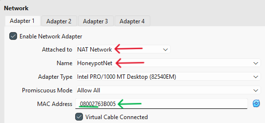
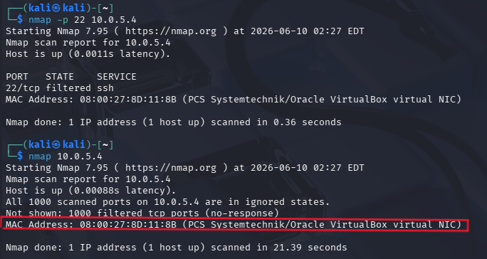
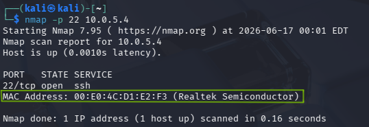
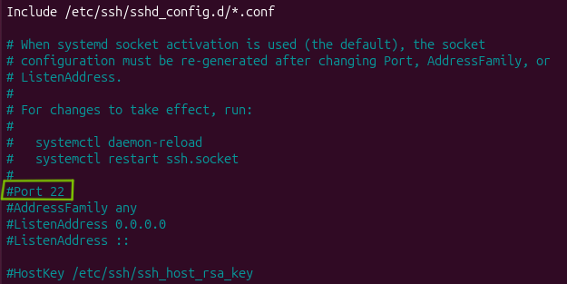
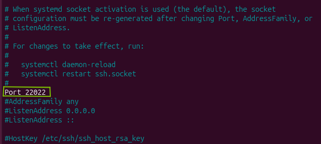

# Cowrie-Honeypot-Deployment-Attack-Simulation-Lab

This repository documents the setup , network configuration and attack simulation of a Cowrie SSH/Telnet Honeypot deployed on an Ubuntu VM, attacked via a Kali Linux VM within a controlled Oracle VirtualBox environment. 


## 🎯 Project Overview & Goal

The goal of this project is understanding how to setup a honeypot to trap an attacker for log analysis, mastering internal network architecture and traffic redirection using `iptables`, and analyzing adversary behavior using tools like `nmap` and `hydra`.

By simulating the entire attack lifecycle within a controlled Oracle VirtualBox environment, this project demonstrates both the defensive engineering required to safely capture threat intelligence and the offensive techniques used to validate security controls.

## 1. Network Topology & Environment Architecture

To safely simulate an attack environment without exposing the host machine or local network, a strictly isolated virtual infrastructure was established. 

- Attacker Machine: Kali Linux VM
- Honeypot Host: Ubuntu Desktop VM
- Honeypot Software: Cowrie 

### Prerequisites & Baseline Setup

Before configuring the network redirection, the baseline environment was established with the following components:
* **Attacker Note:** A standard instance of Kali Linux configured with standard penetration testing tools (`nmap`, `hydra`).
* **Honeypot Node:** A fresh deployment of Ubuntu Desktop.
* **Honeypot Software:** Cowrie installed under a dedicated, non-root system user (`cowrie`) following standard deployment practices, initially listening on the default non-privileged port `2222`.

VirtualBox Network Configuration
Standard NAT configurations isolate VMs from each other, while Host-only networks lack external internet access (needed for installing dependencies for `Cowrie` on Ubuntu and `nmap` & `hydra` for Kali). To solve this, a NAT Network was implemented. 
    
- Adapter 1: Attached to NAT Network (allow VM-to-VM communication and external internet access for updates and installations). As the red arrows show in the screenshot below. 



- Opsec / Stealthy Tweak: VirtualBox MAC addresses default to an OUI registered to Oracle (e.g., 08:00:27) as the green arrow points to above. To prevent attacker running `nmap` from immediately identifying the honeypots as a VirtualBox VM, the MAC address was spoofed/manually changed in the VirtualBox advanced network settings to resemble a standard hardware vendor (e.g. Intel or Realtek).

Default MAC Address scanned result: 


Spoofed MAC Address scanned result:



## 2 Port Redirection & Firewall Configuration (iptables & UFW)
Cowrie natively runs as a non-root user for security reasons, meaning it cannot bind to privileged ports like standard SSH (Port 22). Cowrie listens on Port 2222 by default. 

However, attackers expect standard SSH on Port 22. To seamlessly intercept traffic without Cowrie running as root, iptables - Destination Network Address Translation (DNAT) was configured alongside Ubuntu's Uncomplicated Firewall(UFW).

### The iptables Dilemma & Solution
If an attacker targets Port 22, the Ubuntu host must transparently route that traffic internally to Port 2222. 

1. Change Default SSH: First, the host machine's actual management SSH server was moved away from Port 22 (e.g., to Port 22022) in /etc/ssh/sshd_config to prevent locking ourselves out. 



**&darr;**




2. Apply Prerouting Rule: The following rule was applied to redirect incoming TCP traffic on Port 22 to Port 2222. 

```sudo iptables -t nat -A PREROUTING -p tcp --dport 22 -j REDIRECT --to-ports 2222```

3. Persisting the Rules: Standard iptables rules wipe upon reboot. To make this persistent, iptables-persistent was utilized: 

``` sudo apt```

Managing UFW Conflicts
Ubuntu's UFW can inadvertently block iptables NAT rules if not carefully aligned. 
- UFW was configured to allow incoming traffic on Port 22 (which gets intercepted by the NAT rule before UFW evaluation) and explicitly allowed Port 2222 for the Cowrie framework. 

- The /etc/ufw/before.rules file was modified to ensure the loopback and internal forwarding tables properly processed the translated packets without dropping them. 

## 3 Attack Simulation Walkthrough
With the network bridged and traffic successfully routing into the honeypot container, the attack phase simulates an adversary reconnaissance and brute-force lifecycle. 

### Phase 1: Reconnaissance (nmap)
From the Kali Linux terminal, an aggressive service scan is initiated against the Ubuntu honeypot IP address to verify if the port translation works and if the honeypot mimics a real service successfully. 

```nmap -sV -p 22 10.0.5.4```


