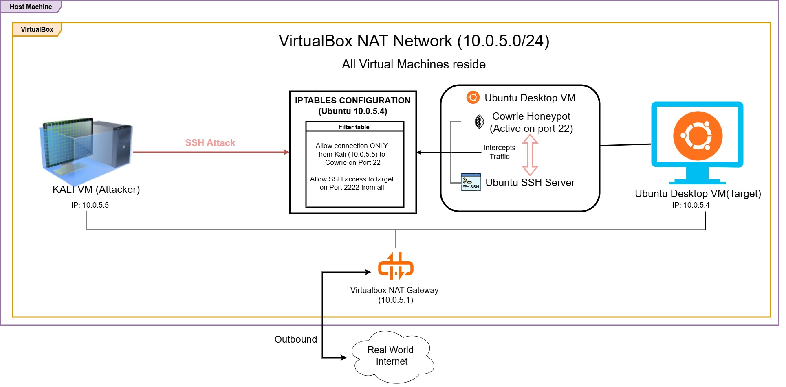

# Cowrie-Honeypot-Deployment-Attack-Simulation-Lab
A learning purpose homelab simulation

This repository documents the setup , network configuration and attack simulation of a Cowrie SSH/Telnet Honeypot deployed on an Ubuntu VM, attacked via a Kali Linux VM within a controlled Oracle VirtualBox environment. 

## 🎯 Project Overview & Goal

The goal of this project is understanding how to setup a honeypot to trap an attacker for log analysis, mastering internal network architecture and traffic redirection using `iptables`, and analyzing adversary behavior using tools like `nmap` and `hydra`.

By simulating the entire attack lifecycle within a controlled Oracle VirtualBox environment, this project demonstrates both the defensive engineering required to safely capture threat intelligence and the offensive techniques used to validate security controls.

## 1. Network Topology & Environment Architecture

To safely simulate an attack environment without exposing the host machine or local network, a strictly isolated virtual infrastructure was established. 

- Attacker Machine: Kali Linux VM
- Honeypot Host: Ubuntu Desktop VM
- Honeypot Software: Cowrie 

### Prerequisites & Baseline Setup

Before configuring the network redirection, the baseline environment was established with the following components:
* **Attacker Note:** A standard instance of Kali Linux configured with standard penetration testing tools (`nmap`, `hydra`).
* **Honeypot Node:** A fresh deployment of Ubuntu Desktop.
* **Honeypot Software:** Cowrie installed under a dedicated, non-root system user (`cowrie`) following standard deployment practices, initially listening on the default non-privileged port `2222`.